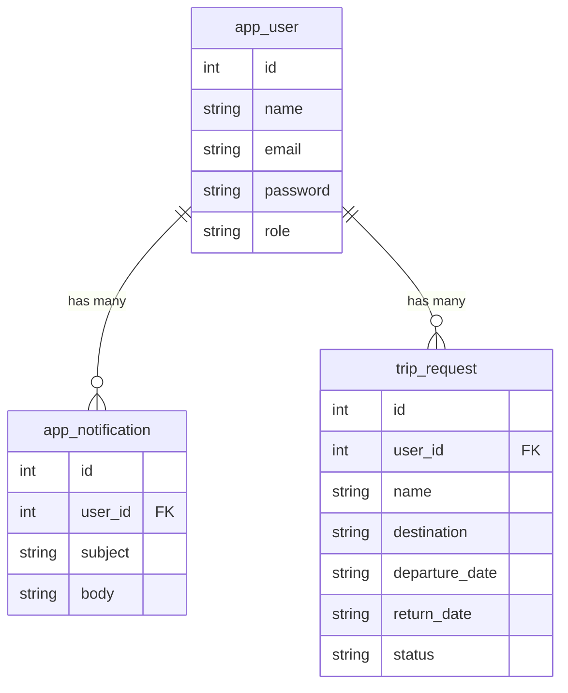

# Teste Onfly

## Instalação e execução

```bash
yarn dev
```

Basta executar o comando acima somente. Todo o necessário para a aplicação funcionar será instalado automaticamente sem nenhum comando adicional.

| Serviço     | URL                   |
| ----------- | --------------------- |
| Backend     | http://localhost:8000 |
| Frontend    | http://localhost:3000 |
| Cloudbeaver | http://localhost:8978 |

## Testes Unitários

- Inicie a aplicação com o comando `yarn dev`;
- Execute os testes com o comando `yarn test`.

## Tasks

- Backend
  - ✅ ~~Criar o repositório~~
  - ✅ ~~Preparar ambiente Docker~~
  - ✅ ~~Usuários (id, name, email, password, role)~~
  - ✅ ~~Sistema de autenticação~~
  - 🟥 Notificação (id, name, message, to_user_id)
  - 🟥 Pedido de viagem (id, name, destination, departure_date, return_date, status)
- Frontend
  - ✅ Autenticação
  - ✅ Dashboard
  - 🟥 Formulário de pedidos
  - ✅ Área administrativa para aprovação/cancelamento de pedidos

## Schema



## Observações de Modelagem

- Utilizei string em vez de enums por acreditar que seria uma solução de manutenção mais simples, por não necessitar escrever uma nova migration.

## Problemas Conhecidos

Tenho ciência que alguns detalhes da estrutura do sistema são problemáticos, mas levei em consideração que pelo curto prazo de tempo, serão analisados apenas os requisitos técnicos básicos. Segue alguns problemas que tenho conciência que deveriam ter uma solução mais robusta para uma aplicação real:

- Campo `trip_request.destination` é uma string.
- Não foram aplicadas validações no frontend.
- Os dados não estão passando por tratamento antes de salvar (remoção de pontos, espaços, conversão para maiúsculo, etc);
- Validações no backend não foram traduzidas;
- Interface de paginação precisa de melhorias;
- Não foi inserida a opção de visualização de notificações (coluna "visualizado em");

## Desafio

Desenvolva uma aplicação Full Stack que gerencia pedidos de viagem corporativa. O sistema deve ter uma API REST desenvolvida em Laravel e uma interface interativa em Vue.js para que os usuários possam interagir com as funcionalidades.

### Requisitos do Back-end (Laravel)

- **Criar um pedido de viagem**: Um pedido deve incluir o ID do pedido, o nome do solicitante, o destino, a data de ida, a data de volta e o status (solicitado, aprovado, cancelado).
- **Consultar um pedido de viagem**: Retornar as informações detalhadas de um pedido de viagem com base no ID fornecido.
- **Listar todos os pedidos de viagem**: Retornar todos os pedidos de viagem cadastrados, com a opção de filtrar por status, período de tempo (ex: pedidos feitos ou com datas de viagem dentro de uma faixa de datas) e destino.
- **Atualizar o status de um pedido de viagem**: Possibilitar a atualização do status para "aprovado" ou "cancelado". (nota: o usuário que fez o pedido não pode alterar o status do mesmo, somente um usuário administrador)
- **Cancelar pedido de viagem após aprovação**: Implementar uma lógica de negócios que só permita o cancelamento do pedido caso ele ainda não tenha sido aprovado
- **Notificação de aprovação ou cancelamento**: Sempre que um pedido for aprovado ou cancelado, uma notificação deve ser enviada para o usuário que solicitou o pedido.

Requisitos do Front-end (Vue.js)

- **Dashboard**: Uma interface principal que exibe todos os pedidos de viagem em uma tabela com a opção de filtrar por status.
- **Formulário para criação de pedidos**: Uma página ou modal para que o usuário possa criar um novo pedido de viagem.
- **Atualização de status**: Possibilite a atualização do status dos pedidos diretamente na tabela ou em uma página dedicada.
- **Autenticação de usuário**: Uma tela de login que consome a API de autenticação e armazena o token JWT para proteger as rotas da aplicação.
- **Feedback ao usuário**: Mensagens claras de sucesso ou erro ao criar ou atualizar pedidos, bem como um loading spinner durante operações assíncronas.

### Requisitos Gerais

- Utilize **Docker** para facilitar a execução do back-end e do front-end.
- Estruture o projeto de maneira limpa, seguindo boas práticas tanto no Laravel quanto no Vue.js.
- Escreva **testes unitários** para as principais funcionalidades do back-end.
- Implemente **autenticação simples** usando tokens (como JWT) para proteger a API.
- Crie um relacionamento entre as ordens de viagem e o usuário autenticado e faça com que cada usuário possa criar, visualizar e listar apenas as suas **próprias ordens**.
- Documente seu projeto com um README.md explicando:
- Como executar o back-end (Laravel) e o front-end (Vue.js).
- Configurações necessárias (variáveis de ambiente, banco de dados, etc.).
- Instruções para rodar os testes.
- Qualquer outra informação relevante sobre a sua solução.

### Critérios de Avaliação

- **Organização e Qualidade do Código**: Estrutura, clareza e aderência às boas práticas no Laravel e no Vue.js.
- **Uso de Boas Práticas no Front-end e Back-end**: Como você utiliza os recursos dos frameworks de maneira eficiente.
- **UI/UX**: A interface é intuitiva e fácil de usar? Há atenção aos detalhes na experiência do usuário?
- **Eficiência da Solução**: Avaliação da performance geral do sistema.
- **Testes Automatizados**: Cobertura de testes no back-end e como isso garante a confiabilidade da aplicação.
- **Documentação**: A clareza das instruções para configurar e executar o projeto.

### Como entregar

- Suba o projeto em um repositório **público** no GitHub e compartilhe o acesso com nosso time (envie para este e-mail mesmo).
- No repositório, inclua um **README.md** com as instruções para:
- Instalar as dependências.
- Executar o serviço localmente (usando Docker).
- Configurar o ambiente (variáveis de ambiente, banco de dados, etc.).
- Executar os testes.
- Qualquer informação adicional que você considere relevante.
